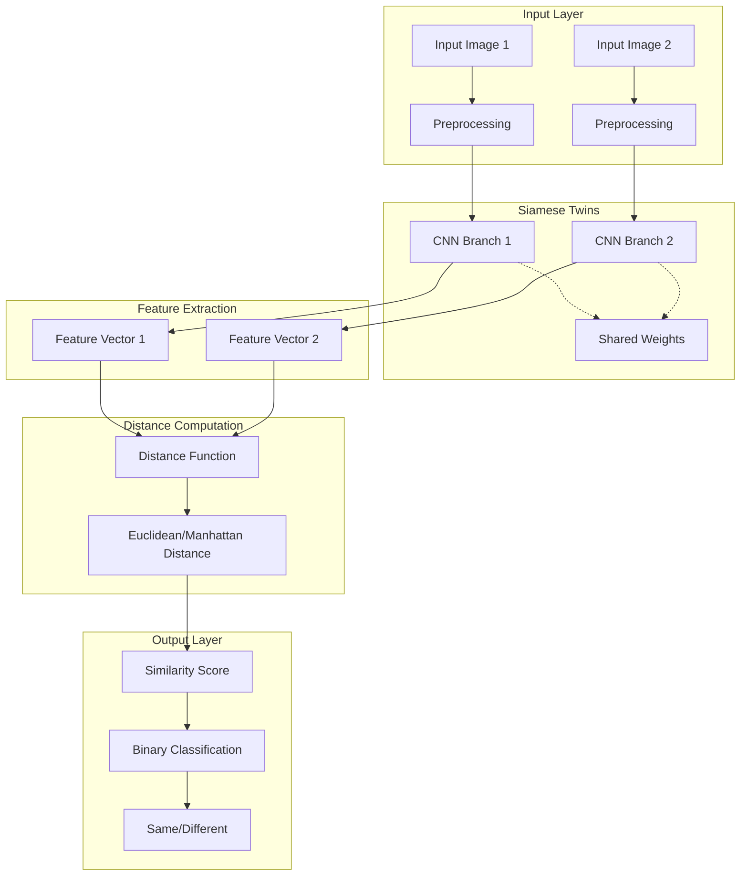

# 🔗 Siamese Neural Network

[](https://www.python.org/downloads/)
[](https://tensorflow.org/)
[](https://keras.io/)
[](https://opencv.org/)
[](https://jupyter.org/)

A sophisticated deep learning implementation of Siamese Neural Networks for similarity learning and one-shot classification tasks. This project demonstrates the power of twin neural networks for comparing and verifying similarities between input pairs, with applications in face verification, signature authentication, and image similarity detection.

## 📋 Table of Contents

- [Overview](#overview)
- [Siamese Network Architecture](#siamese-network-architecture)
- [Features](#features)
- [Technology Stack](#technology-stack)
- [Applications](#applications)
- [Installation & Setup](#installation--setup)
- [Usage Guide](#usage-guide)
- [Model Architecture](#model-architecture)
- [Training Pipeline](#training-pipeline)
- [Dataset Requirements](#dataset-requirements)
- [Performance Metrics](#performance-metrics)
- [Implementation Details](#implementation-details)
- [Evaluation & Testing](#evaluation--testing)
- [Project Structure](#project-structure)
- [Advanced Techniques](#advanced-techniques)
- [Troubleshooting](#troubleshooting)
- [Future Enhancements](#future-enhancements)
- [Contributing](#contributing)
- [License](#license)

## 🎯 Overview

Siamese Neural Networks are a class of neural network architectures that contain two or more identical subnetworks. The networks are called "Siamese" because they share the same configuration, parameters, and weights. This project implements a complete Siamese Network solution for learning similarity functions and performing one-shot learning tasks.

**Key Concepts:**
- 🔗 **Twin Architecture**: Two identical neural networks with shared weights
- 📏 **Distance Learning**: Learning meaningful distance metrics between inputs
- 🎯 **One-Shot Learning**: Classification with minimal training examples
- ⚖️ **Contrastive Loss**: Specialized loss function for similarity learning
- 🔄 **Weight Sharing**: Identical parameters across network branches

## 🏗️ Siamese Network Architecture



### Architecture Principles

1. **Shared Parameters**: Both networks use identical weights and biases
2. **Symmetric Processing**: Same transformations applied to both inputs
3. **Distance Metric Learning**: Networks learn to output similar features for similar inputs
4. **Contrastive Training**: Uses pairs of similar and dissimilar examples

## 🚀 Features

### Core Capabilities
- **Similarity Learning**: Learn to determine if two inputs are similar or different
- **One-Shot Classification**: Classify new examples with minimal training data
- **Face Verification**: Verify if two face images belong to the same person
- **Signature Authentication**: Verify authentic vs. forged signatures
- **Image Similarity**: General-purpose image similarity comparison

### Technical Features
- **Flexible Architecture**: Customizable CNN backbone (ResNet, VGG, custom)
- **Multiple Loss Functions**: Contrastive loss, triplet loss, binary cross-entropy
- **Data Augmentation**: Comprehensive image augmentation pipeline
- **Batch Processing**: Efficient batch training with pair generation
- **Model Checkpointing**: Save and restore training progress

### Advanced Features
- **Hard Negative Mining**: Focus training on difficult examples
- **Metric Learning**: Learn optimal distance metrics for the task
- **Transfer Learning**: Pre-trained feature extractors
- **Real-time Inference**: Fast prediction for production deployment

## 🛠️ Technology Stack

### Deep Learning Framework
```
🔥 TensorFlow 2.5+         - Primary deep learning framework
🎯 Keras                   - High-level neural network API
📊 NumPy 1.19+             - Numerical computing
🖼️ OpenCV 4.5+            - Computer vision operations
```

### Data Processing & Visualization
```
🐼 Pandas 1.3+             - Data manipulation and analysis
📊 Matplotlib 3.3+         - Plotting and visualization
📈 Seaborn 0.11+           - Statistical data visualization
🔍 PIL/Pillow              - Image processing utilities
```

### Machine Learning & Utilities
```
📏 scikit-learn 0.24+      - Machine learning utilities
🎲 imgaug 1.2+             - Image augmentation library
📁 h5py 3.1+               - HDF5 file format support
📓 Jupyter Notebook        - Interactive development
```

### Model Development & Deployment
```
⚡ TensorFlow Serving      - Model serving infrastructure
🐳 Docker                 - Containerization
📊 TensorBoard            - Training visualization
🔧 MLflow                 - ML lifecycle management
```

## 🎯 Applications

### 1. Face Verification
```python
# Face verification example
def verify_faces(face1_path, face2_path, model, threshold=0.5):
    """
    Verify if two face images belong to the same person.
    
    Args:
        face1_path: Path to first face image
        face2_path: Path to second face image
        model: Trained Siamese model
        threshold: Similarity threshold
    
    Returns:
        bool: True if same person, False otherwise
    """
    img1 = preprocess_image(face1_path)
    img2 = preprocess_image(face2_path)
    
    similarity = model.predict([img1, img2])
    return similarity > threshold
```

### 2. Signature Verification
```python
# Signature authentication
def authenticate_signature(original_sig, test_sig, model):
    """Verify signature authenticity."""
    similarity_score = model.predict([original_sig, test_sig])
    return similarity_score > 0.7  # Threshold for authentication
```

### 3. Image Similarity Search
```python
# Find similar images in database
def find_similar_images(query_image, image_database, model, top_k=5):
    """Find top-k similar images."""
    similarities = []
    for db_image in image_database:
        sim_score = model.predict([query_image, db_image])
        similarities.append(sim_score)
    
    # Return top-k most similar
    return sorted(zip(image_database, similarities), 
                 key=lambda x: x[1], reverse=True)[:top_k]
```

### 4. One-Shot Learning
```python
# Few-shot classification
class OneShotClassifier:
    def __init__(self, siamese_model):
        self.model = siamese_model
        self.support_set = {}
    
    def add_class_example(self, class_name, example_image):
        """Add single example for new class."""
        self.support_set[class_name] = example_image
    
    def classify(self, query_image):
        """Classify query image using support set."""
        max_similarity = 0
        predicted_class = None
        
        for class_name, support_image in self.support_set.items():
            similarity = self.model.predict([query_image, support_image])
            if similarity > max_similarity:
                max_similarity = similarity
                predicted_class = class_name
        
        return predicted_class, max_similarity
```

## 📦 Installation & Setup

### Prerequisites
- Python 3.7 or higher
- CUDA 11.0+ (for GPU acceleration)
- 8GB+ RAM (16GB recommended)
- GPU with 4GB+ VRAM (recommended)

### Step 1: Clone Repository
```bash
git clone https://github.com/Arshnoor-Singh-Sohi/Siamese-Network.git
cd Siamese-Network
```

### Step 2: Create Virtual Environment
```bash
# Create virtual environment
python -m venv siamese_env

# Activate environment
# Windows:
siamese_env\Scripts\activate
# macOS/Linux:
source siamese_env/bin/activate
```

### Step 3: Install Dependencies
```bash
# Install TensorFlow (GPU version)
pip install tensorflow-gpu==2.8.0

# Install other requirements
pip install numpy pandas matplotlib seaborn
pip install opencv-python pillow scikit-learn
pip install imgaug h5py jupyter

# Alternative: Install from requirements file
pip install -r requirements.txt
```

### Step 4: Verify Installation
```bash
# Test GPU availability
python -c "import tensorflow as tf; print('GPU Available:', tf.config.list_physical_devices('GPU'))"

# Test OpenCV
python -c "import cv2; print('OpenCV version:', cv2.__version__)"
```

### Step 5: Launch Jupyter Notebook
```bash
# Start Jupyter Notebook
jupyter notebook

# Open the main notebook
# Navigate to siameseNetwork.ipynb
```

## 💻 Usage Guide

### Basic Implementation

#### 1. Data Preparation
```python
import tensorflow as tf
from tensorflow import keras
import numpy as np
import cv2
from sklearn.model_selection import train_test_split

# Image preprocessing function
def preprocess_image(image_path, target_size=(224, 224)):
    """Load and preprocess image for Siamese network."""
    image = cv2.imread(image_path)
    image = cv2.cvtColor(image, cv2.COLOR_BGR2RGB)
    image = cv2.resize(image, target_size)
    image = image.astype('float32') / 255.0
    return image

# Create image pairs for training
def create_pairs(images, labels):
    """Create positive and negative pairs for training."""
    pairs = []
    labels_pairs = []
    
    num_classes = len(np.unique(labels))
    
    # Create positive pairs (same class)
    for class_idx in range(num_classes):
        class_images = images[labels == class_idx]
        num_images = len(class_images)
        
        for i in range(num_images):
            for j in range(i + 1, num_images):
                pairs.append([class_images[i], class_images[j]])
                labels_pairs.append(1)  # Same class
    
    # Create negative pairs (different classes)
    for i in range(len(images)):
        for j in range(len(images)):
            if labels[i] != labels[j]:
                pairs.append([images[i], images[j]])
                labels_pairs.append(0)  # Different class
    
    return np.array(pairs), np.array(labels_pairs)
```

#### 2. Model Architecture
```python
# Siamese Network Implementation
def create_base_network(input_shape):
    """Create the base CNN network for feature extraction."""
    model = keras.Sequential([
        keras.layers.Conv2D(32, (3, 3), activation='relu', input_shape=input_shape),
        keras.layers.MaxPooling2D((2, 2)),
        keras.layers.Conv2D(64, (3, 3), activation='relu'),
        keras.layers.MaxPooling2D((2, 2)),
        keras.layers.Conv2D(128, (3, 3), activation='relu'),
        keras.layers.MaxPooling2D((2, 2)),
        keras.layers.Flatten(),
        keras.layers.Dense(128, activation='relu'),
        keras.layers.Dropout(0.5),
        keras.layers.Dense(64, activation='relu')
    ])
    return model

def create_siamese_network(input_shape):
    """Create complete Siamese network."""
    # Input layers
    input_a = keras.layers.Input(shape=input_shape)
    input_b = keras.layers.Input(shape=input_shape)
    
    # Base network (shared weights)
    base_network = create_base_network(input_shape)
    
    # Generate embeddings for both inputs
    embedding_a = base_network(input_a)
    embedding_b = base_network(input_b)
    
    # Calculate distance between embeddings
    distance = keras.layers.Lambda(euclidean_distance)([embedding_a, embedding_b])
    
    # Output layer
    output = keras.layers.Dense(1, activation='sigmoid')(distance)
    
    # Create model
    model = keras.Model([input_a, input_b], output)
    
    return model

def euclidean_distance(vectors):
    """Calculate Euclidean distance between two vectors."""
    x, y = vectors
    sum_square = tf.reduce_sum(tf.square(x - y), axis=1, keepdims=True)
    return tf.sqrt(tf.maximum(sum_square, tf.keras.backend.epsilon()))
```

#### 3. Loss Functions
```python
# Contrastive Loss Implementation
def contrastive_loss(y_true, y_pred, margin=1.0):
    """
    Contrastive loss function for Siamese networks.
    
    Args:
        y_true: True labels (1 for similar, 0 for dissimilar)
        y_pred: Predicted distances
        margin: Margin parameter for negative pairs
    """
    square_pred = tf.square(y_pred)
    margin_square = tf.square(tf.maximum(margin - y_pred, 0.0))
    
    loss = y_true * square_pred + (1 - y_true) * margin_square
    return tf.reduce_mean(loss)

# Alternative: Binary cross-entropy with distance transformation
def distance_based_loss(y_true, y_pred):
    """Convert distance to probability and use BCE loss."""
    # Convert distance to similarity probability
    similarity = tf.exp(-y_pred)
    return keras.losses.binary_crossentropy(y_true, similarity)
```

#### 4. Training Process
```python
# Training configuration
def train_siamese_network(model, train_pairs, train_labels, val_pairs, val_labels):
    """Train the Siamese network."""
    
    # Compile model
    model.compile(
        optimizer=keras.optimizers.Adam(learning_rate=0.001),
        loss=contrastive_loss,
        metrics=['accuracy']
    )
    
    # Callbacks
    callbacks = [
        keras.callbacks.ModelCheckpoint(
            'best_siamese_model.h5',
            save_best_only=True,
            monitor='val_loss'
        ),
        keras.callbacks.ReduceLROnPlateau(
            monitor='val_loss',
            factor=0.5,
            patience=5,
            min_lr=1e-7
        ),
        keras.callbacks.EarlyStopping(
            monitor='val_loss',
            patience=10,
            restore_best_weights=True
        )
    ]
    
    # Train model
    history = model.fit(
        [train_pairs[:, 0], train_pairs[:, 1]], train_labels,
        validation_data=([val_pairs[:, 0], val_pairs[:, 1]], val_labels),
        epochs=100,
        batch_size=32,
        callbacks=callbacks,
        verbose=1
    )
    
    return history
```

### Advanced Usage

#### Data Augmentation Pipeline
```python
import imgaug.augmenters as iaa

# Create augmentation pipeline
def create_augmentation_pipeline():
    """Create image augmentation pipeline for training."""
    return iaa.Sequential([
        iaa.Sometimes(0.5, iaa.GaussianBlur(sigma=(0, 0.5))),
        iaa.Sometimes(0.5, iaa.Affine(
            scale={"x": (0.8, 1.2), "y": (0.8, 1.2)},
            translate_percent={"x": (-0.2, 0.2), "y": (-0.2, 0.2)},
            rotate=(-15, 15),
            shear=(-8, 8)
        )),
        iaa.Sometimes(0.5, iaa.AdditiveGaussianNoise(
            loc=0, scale=(0.0, 0.05*255), per_channel=0.5
        )),
        iaa.Sometimes(0.5, iaa.Multiply((0.8, 1.2), per_channel=0.2)),
        iaa.Sometimes(0.5, iaa.LinearContrast((0.75, 1.5))),
        iaa.Sometimes(0.5, iaa.Fliplr(0.5))
    ])

# Apply augmentation to pairs
def augment_pairs(pairs, augmenter):
    """Apply augmentation to image pairs."""
    augmented_pairs = []
    for pair in pairs:
        # Augment both images in the pair
        aug_pair = [
            augmenter(image=pair[0]),
            augmenter(image=pair[1])
        ]
        augmented_pairs.append(aug_pair)
    return np.array(augmented_pairs)
```

#### Transfer Learning Implementation
```python
# Use pre-trained models as backbone
def create_transfer_learning_base(input_shape, backbone='ResNet50'):
    """Create base network using pre-trained models."""
    
    if backbone == 'ResNet50':
        base_model = keras.applications.ResNet50(
            weights='imagenet',
            include_top=False,
            input_shape=input_shape
        )
    elif backbone == 'VGG16':
        base_model = keras.applications.VGG16(
            weights='imagenet',
            include_top=False,
            input_shape=input_shape
        )
    elif backbone == 'EfficientNetB0':
        base_model = keras.applications.EfficientNetB0(
            weights='imagenet',
            include_top=False,
            input_shape=input_shape
        )
    
    # Freeze base model layers
    base_model.trainable = False
    
    # Add custom head
    model = keras.Sequential([
        base_model,
        keras.layers.GlobalAveragePooling2D(),
        keras.layers.Dense(256, activation='relu'),
        keras.layers.Dropout(0.5),
        keras.layers.Dense(128, activation='relu')
    ])
    
    return model
```

## 📊 Model Architecture

### Standard CNN Backbone
```python
# Custom CNN architecture for feature extraction
def create_custom_cnn_backbone(input_shape):
    """Create custom CNN backbone optimized for similarity learning."""
    
    model = keras.Sequential([
        # First Conv Block
        keras.layers.Conv2D(64, (3, 3), activation='relu', input_shape=input_shape),
        keras.layers.BatchNormalization(),
        keras.layers.Conv2D(64, (3, 3), activation='relu'),
        keras.layers.MaxPooling2D((2, 2)),
        keras.layers.Dropout(0.25),
        
        # Second Conv Block
        keras.layers.Conv2D(128, (3, 3), activation='relu'),
        keras.layers.BatchNormalization(),
        keras.layers.Conv2D(128, (3, 3), activation='relu'),
        keras.layers.MaxPooling2D((2, 2)),
        keras.layers.Dropout(0.25),
        
        # Third Conv Block
        keras.layers.Conv2D(256, (3, 3), activation='relu'),
        keras.layers.BatchNormalization(),
        keras.layers.Conv2D(256, (3, 3), activation='relu'),
        keras.layers.MaxPooling2D((2, 2)),
        keras.layers.Dropout(0.25),
        
        # Feature extraction
        keras.layers.GlobalAveragePooling2D(),
        keras.layers.Dense(512, activation='relu'),
        keras.layers.BatchNormalization(),
        keras.layers.Dropout(0.5),
        keras.layers.Dense(256, activation='relu'),
        keras.layers.BatchNormalization(),
        keras.layers.Dense(128)  # Final embedding dimension
    ])
    
    return model
```

### Attention Mechanism
```python
# Add attention mechanism for better feature focus
class AttentionLayer(keras.layers.Layer):
    """Attention mechanism for Siamese networks."""
    
    def __init__(self, units):
        super(AttentionLayer, self).__init__()
        self.units = units
        self.W = keras.layers.Dense(units)
        self.V = keras.layers.Dense(1)
        
    def call(self, inputs):
        # inputs shape: (batch_size, seq_len, features)
        score = self.V(tf.nn.tanh(self.W(inputs)))
        attention_weights = tf.nn.softmax(score, axis=1)
        context_vector = attention_weights * inputs
        context_vector = tf.reduce_sum(context_vector, axis=1)
        return context_vector

# Integrate attention in Siamese network
def create_attention_siamese_network(input_shape):
    """Siamese network with attention mechanism."""
    
    # Base CNN
    base_cnn = create_custom_cnn_backbone(input_shape)
    
    # Inputs
    input_a = keras.layers.Input(shape=input_shape)
    input_b = keras.layers.Input(shape=input_shape)
    
    # Extract features
    features_a = base_cnn(input_a)
    features_b = base_cnn(input_b)
    
    # Apply attention
    attention_layer = AttentionLayer(128)
    attended_a = attention_layer(tf.expand_dims(features_a, 1))
    attended_b = attention_layer(tf.expand_dims(features_b, 1))
    
    # Calculate similarity
    distance = keras.layers.Lambda(euclidean_distance)([attended_a, attended_b])
    output = keras.layers.Dense(1, activation='sigmoid')(distance)
    
    model = keras.Model([input_a, input_b], output)
    return model
```

## 🎓 Training Pipeline

### Complete Training Workflow
```python
class SiameseTrainer:
    """Complete training pipeline for Siamese networks."""
    
    def __init__(self, input_shape, architecture='custom'):
        self.input_shape = input_shape
        self.architecture = architecture
        self.model = None
        self.history = None
        
    def build_model(self):
        """Build the Siamese network model."""
        if self.architecture == 'custom':
            self.model = create_siamese_network(self.input_shape)
        elif self.architecture == 'resnet':
            base = create_transfer_learning_base(self.input_shape, 'ResNet50')
            self.model = create_siamese_with_base(base, self.input_shape)
        elif self.architecture == 'attention':
            self.model = create_attention_siamese_network(self.input_shape)
            
        return self.model
    
    def prepare_data(self, images, labels, test_size=0.2, augment=True):
        """Prepare training and validation data."""
        # Create pairs
        pairs, pair_labels = create_pairs(images, labels)
        
        # Split data
        train_pairs, val_pairs, train_labels, val_labels = train_test_split(
            pairs, pair_labels, test_size=test_size, stratify=pair_labels, random_state=42
        )
        
        # Apply augmentation
        if augment:
            augmenter = create_augmentation_pipeline()
            train_pairs = augment_pairs(train_pairs, augmenter)
        
        return train_pairs, val_pairs, train_labels, val_labels
    
    def train(self, train_pairs, train_labels, val_pairs, val_labels, 
              epochs=100, batch_size=32, learning_rate=0.001):
        """Train the Siamese network."""
        
        # Compile model
        self.model.compile(
            optimizer=keras.optimizers.Adam(learning_rate=learning_rate),
            loss=contrastive_loss,
            metrics=['accuracy']
        )
        
        # Callbacks
        callbacks = self._create_callbacks()
        
        # Train
        self.history = self.model.fit(
            [train_pairs[:, 0], train_pairs[:, 1]], train_labels,
            validation_data=([val_pairs[:, 0], val_pairs[:, 1]], val_labels),
            epochs=epochs,
            batch_size=batch_size,
            callbacks=callbacks,
            verbose=1
        )
        
        return self.history
    
    def _create_callbacks(self):
        """Create training callbacks."""
        return [
            keras.callbacks.ModelCheckpoint(
                'models/best_siamese_model.h5',
                save_best_only=True,
                monitor='val_loss',
                mode='min'
            ),
            keras.callbacks.ReduceLROnPlateau(
                monitor='val_loss',
                factor=0.5,
                patience=5,
                min_lr=1e-7,
                verbose=1
            ),
            keras.callbacks.EarlyStopping(
                monitor='val_loss',
                patience=15,
                restore_best_weights=True,
                verbose=1
            ),
            keras.callbacks.TensorBoard(
                log_dir='logs',
                histogram_freq=1,
                write_graph=True
            )
        ]
    
    def evaluate(self, test_pairs, test_labels):
        """Evaluate model performance."""
        predictions = self.model.predict([test_pairs[:, 0], test_pairs[:, 1]])
        
        # Convert to binary predictions
        binary_predictions = (predictions > 0.5).astype(int)
        
        # Calculate metrics
        from sklearn.metrics import accuracy_score, precision_score, recall_score, f1_score
        
        accuracy = accuracy_score(test_labels, binary_predictions)
        precision = precision_score(test_labels, binary_predictions)
        recall = recall_score(test_labels, binary_predictions)
        f1 = f1_score(test_labels, binary_predictions)
        
        metrics = {
            'accuracy': accuracy,
            'precision': precision,
            'recall': recall,
            'f1_score': f1
        }
        
        return metrics, predictions
```

### Hard Negative Mining
```python
def hard_negative_mining(model, pairs, labels, ratio=0.3):
    """Implement hard negative mining for better training."""
    
    # Get predictions for all pairs
    predictions = model.predict([pairs[:, 0], pairs[:, 1]])
    
    # Find hard negatives (high similarity for different classes)
    negative_indices = np.where(labels == 0)[0]
    negative_predictions = predictions[negative_indices]
    
    # Sort by highest similarity (hardest negatives)
    hard_negative_indices = negative_indices[
        np.argsort(negative_predictions.flatten())[::-1]
    ]
    
    # Select top ratio of hard negatives
    num_hard_negatives = int(len(hard_negative_indices) * ratio)
    selected_hard_negatives = hard_negative_indices[:num_hard_negatives]
    
    # Combine with all positive pairs
    positive_indices = np.where(labels == 1)[0]
    final_indices = np.concatenate([positive_indices, selected_hard_negatives])
    
    return pairs[final_indices], labels[final_indices]
```

## 📊 Dataset Requirements

### Data Structure
```
dataset/
├── train/
│   ├── class_1/
│   │   ├── image_001.jpg
│   │   ├── image_002.jpg
│   │   └── ...
│   ├── class_2/
│   │   ├── image_001.jpg
│   │   ├── image_002.jpg
│   │   └── ...
│   └── ...
├── validation/
│   └── [same structure as train]
└── test/
    └── [same structure as train]
```

### Data Loader Implementation
```python
class SiameseDataLoader:
    """Custom data loader for Siamese networks."""
    
    def __init__(self, data_dir, image_size=(224, 224), batch_size=32):
        self.data_dir = data_dir
        self.image_size = image_size
        self.batch_size = batch_size
        self.classes = self._get_classes()
        self.images_per_class = self._load_images_per_class()
        
    def _get_classes(self):
        """Get list of classes from directory structure."""
        return [d for d in os.listdir(self.data_dir) 
                if os.path.isdir(os.path.join(self.data_dir, d))]
    
    def _load_images_per_class(self):
        """Load image paths organized by class."""
        images_per_class = {}
        for class_name in self.classes:
            class_dir = os.path.join(self.data_dir, class_name)
            images = [os.path.join(class_dir, img) 
                     for img in os.listdir(class_dir)
                     if img.lower().endswith(('.png', '.jpg', '.jpeg'))]
            images_per_class[class_name] = images
        return images_per_class
    
    def generate_batch(self):
        """Generate a batch of image pairs with labels."""
        while True:
            batch_pairs = []
            batch_labels = []
            
            for _ in range(self.batch_size):
                # Randomly decide if this should be a positive or negative pair
                if np.random.random() < 0.5:
                    # Positive pair (same class)
                    class_name = np.random.choice(self.classes)
                    if len(self.images_per_class[class_name]) >= 2:
                        img1_path, img2_path = np.random.choice(
                            self.images_per_class[class_name], 2, replace=False
                        )
                        label = 1
                    else:
                        continue
                else:
                    # Negative pair (different classes)
                    class1, class2 = np.random.choice(self.classes, 2, replace=False)
                    img1_path = np.random.choice(self.images_per_class[class1])
                    img2_path = np.random.choice(self.images_per_class[class2])
                    label = 0
                
                # Load and preprocess images
                img1 = self._load_and_preprocess_image(img1_path)
                img2 = self._load_and_preprocess_image(img2_path)
                
                batch_pairs.append([img1, img2])
                batch_labels.append(label)
            
            if len(batch_pairs) == self.batch_size:
                batch_pairs = np.array(batch_pairs)
                batch_labels = np.array(batch_labels)
                yield ([batch_pairs[:, 0], batch_pairs[:, 1]], batch_labels)
    
    def _load_and_preprocess_image(self, image_path):
        """Load and preprocess a single image."""
        image = cv2.imread(image_path)
        image = cv2.cvtColor(image, cv2.COLOR_BGR2RGB)
        image = cv2.resize(image, self.image_size)
        image = image.astype('float32') / 255.0
        return image
```

## 📈 Performance Metrics

### Evaluation Framework
```python
class SiameseEvaluator:
    """Comprehensive evaluation for Siamese networks."""
    
    def __init__(self, model, threshold=0.5):
        self.model = model
        self.threshold = threshold
        
    def evaluate_verification(self, test_pairs, test_labels):
        """Evaluate verification performance."""
        predictions = self.model.predict([test_pairs[:, 0], test_pairs[:, 1]])
        binary_predictions = (predictions > self.threshold).astype(int)
        
        # Calculate metrics
        from sklearn.metrics import (accuracy_score, precision_score, 
                                   recall_score, f1_score, roc_auc_score,
                                   confusion_matrix, classification_report)
        
        metrics = {
            'accuracy': accuracy_score(test_labels, binary_predictions),
            'precision': precision_score(test_labels, binary_predictions),
            'recall': recall_score(test_labels, binary_predictions),
            'f1_score': f1_score(test_labels, binary_predictions),
            'auc_roc': roc_auc_score(test_labels, predictions),
            'confusion_matrix': confusion_matrix(test_labels, binary_predictions),
            'classification_report': classification_report(test_labels, binary_predictions)
        }
        
        return metrics
    
    def evaluate_one_shot_learning(self, support_set, query_set, support_labels, query_labels):
        """Evaluate one-shot learning performance."""
        correct_predictions = 0
        total_predictions = len(query_set)
        
        for i, query_image in enumerate(query_set):
            # Calculate similarities with all support images
            similarities = []
            for support_image in support_set:
                query_expanded = np.expand_dims(query_image, axis=0)
                support_expanded = np.expand_dims(support_image, axis=0)
                similarity = self.model.predict([query_expanded, support_expanded])[0]
                similarities.append(similarity)
            
            # Find most similar support image
            most_similar_idx = np.argmax(similarities)
            predicted_label = support_labels[most_similar_idx]
            
            if predicted_label == query_labels[i]:
                correct_predictions += 1
        
        accuracy = correct_predictions / total_predictions
        return {'one_shot_accuracy': accuracy}
    
    def plot_similarity_distribution(self, test_pairs, test_labels):
        """Plot distribution of similarity scores."""
        predictions = self.model.predict([test_pairs[:, 0], test_pairs[:, 1]])
        
        positive_similarities = predictions[test_labels == 1]
        negative_similarities = predictions[test_labels == 0]
        
        plt.figure(figsize=(12, 6))
        
        plt.subplot(1, 2, 1)
        plt.hist(positive_similarities, bins=50, alpha=0.7, label='Same Class', color='green')
        plt.hist(negative_similarities, bins=50, alpha=0.7, label='Different Class', color='red')
        plt.xlabel('Similarity Score')
        plt.ylabel('Frequency')
        plt.title('Similarity Score Distribution')
        plt.legend()
        
        plt.subplot(1, 2, 2)
        from sklearn.metrics import roc_curve, auc
        fpr, tpr, _ = roc_curve(test_labels, predictions)
        roc_auc = auc(fpr, tpr)
        
        plt.plot(fpr, tpr, color='darkorange', lw=2, 
                label=f'ROC curve (AUC = {roc_auc:.2f})')
        plt.plot([0, 1], [0, 1], color='navy', lw=2, linestyle='--')
        plt.xlim([0.0, 1.0])
        plt.ylim([0.0, 1.05])
        plt.xlabel('False Positive Rate')
        plt.ylabel('True Positive Rate')
        plt.title('ROC Curve')
        plt.legend()
        
        plt.tight_layout()
        plt.show()
```

### Cross-Validation for Siamese Networks
```python
def siamese_cross_validation(images, labels, k_folds=5):
    """Perform k-fold cross-validation for Siamese networks."""
    from sklearn.model_selection import StratifiedKFold
    
    skf = StratifiedKFold(n_splits=k_folds, shuffle=True, random_state=42)
    fold_results = []
    
    for fold, (train_idx, val_idx) in enumerate(skf.split(images, labels)):
        print(f"Training fold {fold + 1}/{k_folds}")
        
        # Split data
        train_images, val_images = images[train_idx], images[val_idx]
        train_labels, val_labels = labels[train_idx], labels[val_idx]
        
        # Create pairs
        train_pairs, train_pair_labels = create_pairs(train_images, train_labels)
        val_pairs, val_pair_labels = create_pairs(val_images, val_labels)
        
        # Create and train model
        model = create_siamese_network(input_shape=(224, 224, 3))
        trainer = SiameseTrainer(input_shape=(224, 224, 3))
        trainer.model = model
        
        history = trainer.train(
            train_pairs, train_pair_labels,
            val_pairs, val_pair_labels,
            epochs=50, batch_size=32
        )
        
        # Evaluate
        evaluator = SiameseEvaluator(model)
        metrics = evaluator.evaluate_verification(val_pairs, val_pair_labels)
        
        fold_results.append(metrics)
        print(f"Fold {fold + 1} Accuracy: {metrics['accuracy']:.4f}")
    
    # Calculate average metrics
    avg_metrics = {}
    for metric in fold_results[0].keys():
        if metric not in ['confusion_matrix', 'classification_report']:
            avg_metrics[f'avg_{metric}'] = np.mean([fold[metric] for fold in fold_results])
            avg_metrics[f'std_{metric}'] = np.std([fold[metric] for fold in fold_results])
    
    return avg_metrics, fold_results
```

## 📁 Project Structure

```
Siamese-Network/
├── 📓 siameseNetwork.ipynb              # Main implementation notebook
├── 📄 README.md                         # Project documentation
├── 📄 requirements.txt                  # Python dependencies
├── 📁 models/                          # Trained models directory
│   ├── 📄 best_siamese_model.h5        # Best trained model
│   ├── 📄 siamese_weights.h5           # Model weights
│   └── 📄 model_architecture.json      # Model architecture
├── 📁 data/                            # Dataset directory
│   ├── 📁 train/                       # Training data
│   ├── 📁 validation/                  # Validation data
│   ├── 📁 test/                        # Test data
│   └── 📁 processed/                   # Preprocessed data
├── 📁 src/                             # Source code modules
│   ├── 📄 __init__.py
│   ├── 📄 siamese_model.py             # Model architecture
│   ├── 📄 data_loader.py               # Data loading utilities
│   ├── 📄 preprocessing.py             # Image preprocessing
│   ├── 📄 training.py                  # Training pipeline
│   ├── 📄 evaluation.py                # Evaluation metrics
│   ├── 📄 utils.py                     # Utility functions
│   └── 📄 visualization.py             # Visualization tools
├── 📁 notebooks/                       # Additional notebooks
│   ├── 📄 01_data_exploration.ipynb    # Data analysis
│   ├── 📄 02_model_experiments.ipynb   # Architecture experiments
│   ├── 📄 03_transfer_learning.ipynb   # Transfer learning
│   └── 📄 04_deployment.ipynb          # Model deployment
├── 📁 configs/                         # Configuration files
│   ├── 📄 model_config.yaml           # Model parameters
│   ├── 📄 training_config.yaml        # Training settings
│   └── 📄 data_config.yaml            # Data processing config
├── 📁 logs/                            # Training logs
│   ├── 📁 tensorboard/                 # TensorBoard logs
│   └── 📁 training_logs/               # Text logs
├── 📁 results/                         # Experiment results
│   ├── 📁 figures/                     # Generated plots
│   ├── 📁 metrics/                     # Performance metrics
│   └── 📁 comparisons/                 # Model comparisons
├── 📁 deployment/                      # Deployment files
│   ├── 📄 Dockerfile                   # Docker configuration
│   ├── 📄 app.py                       # Flask/FastAPI app
│   ├── 📄 requirements_deploy.txt      # Deployment dependencies
│   └── 📁 kubernetes/                  # K8s manifests
└── 📁 tests/                           # Unit tests
    ├── 📄 test_model.py                # Model tests
    ├── 📄 test_data_loader.py          # Data loader tests
    └── 📄 test_preprocessing.py        # Preprocessing tests
```

## 🔧 Advanced Techniques

### Triplet Loss Implementation
```python
def triplet_loss(y_true, y_pred, alpha=0.2):
    """
    Triplet loss for learning embeddings.
    
    Args:
        y_true: Not used in triplet loss
        y_pred: Concatenated [anchor, positive, negative] embeddings
        alpha: Margin parameter
    """
    # Split embeddings
    anchor = y_pred[:, :128]      # First 128 dimensions
    positive = y_pred[:, 128:256] # Second 128 dimensions  
    negative = y_pred[:, 256:]    # Last 128 dimensions
    
    # Calculate distances
    pos_dist = tf.reduce_sum(tf.square(anchor - positive), axis=1)
    neg_dist = tf.reduce_sum(tf.square(anchor - negative), axis=1)
    
    # Triplet loss
    loss = tf.maximum(pos_dist - neg_dist + alpha, 0.0)
    return tf.reduce_mean(loss)

# Triplet network architecture
def create_triplet_network(input_shape):
    """Create triplet network for metric learning."""
    # Shared embedding network
    embedding_network = create_base_network(input_shape)
    
    # Inputs
    anchor_input = keras.layers.Input(shape=input_shape)
    positive_input = keras.layers.Input(shape=input_shape)
    negative_input = keras.layers.Input(shape=input_shape)
    
    # Generate embeddings
    anchor_embedding = embedding_network(anchor_input)
    positive_embedding = embedding_network(positive_input)
    negative_embedding = embedding_network(negative_input)
    
    # Concatenate embeddings for loss calculation
    output = keras.layers.Concatenate()([
        anchor_embedding, positive_embedding, negative_embedding
    ])
    
    model = keras.Model([anchor_input, positive_input, negative_input], output)
    return model
```

### Online Triplet Mining
```python
def online_triplet_mining(embeddings, labels, margin=0.2):
    """Online hard triplet mining during training."""
    
    # Calculate pairwise distances
    pairwise_dist = tf.linalg.norm(
        tf.expand_dims(embeddings, 1) - tf.expand_dims(embeddings, 0), 
        axis=2
    )
    
    # Create masks for positive and negative pairs
    labels_equal = tf.equal(tf.expand_dims(labels, 0), tf.expand_dims(labels, 1))
    labels_not_equal = tf.logical_not(labels_equal)
    
    # For each anchor, find hardest positive and negative
    # Hardest positive: maximum distance among same class
    hardest_positive_dist = tf.reduce_max(
        tf.where(labels_equal, pairwise_dist, tf.zeros_like(pairwise_dist)), 
        axis=1
    )
    
    # Hardest negative: minimum distance among different class
    hardest_negative_dist = tf.reduce_min(
        tf.where(labels_not_equal, pairwise_dist, tf.ones_like(pairwise_dist) * 1e9), 
        axis=1
    )
    
    # Calculate triplet loss
    triplet_loss = tf.maximum(
        hardest_positive_dist - hardest_negative_dist + margin, 0.0
    )
    
    return tf.reduce_mean(triplet_loss)
```

### Curriculum Learning
```python
class CurriculumLearning:
    """Implement curriculum learning for Siamese networks."""
    
    def __init__(self, easy_threshold=0.8, hard_threshold=0.3):
        self.easy_threshold = easy_threshold
        self.hard_threshold = hard_threshold
        self.current_epoch = 0
        
    def get_difficulty_ratio(self, epoch):
        """Determine ratio of easy vs hard examples based on epoch."""
        if epoch < 10:
            return 0.8  # 80% easy examples
        elif epoch < 30:
            return 0.5  # 50% easy examples
        else:
            return 0.2  # 20% easy examples
            
    def sample_pairs_by_difficulty(self, pairs, labels, model, epoch):
        """Sample pairs based on current curriculum stage."""
        if model is None:
            return pairs, labels
            
        # Get current predictions
        predictions = model.predict([pairs[:, 0], pairs[:, 1]])
        
        # Classify pairs by difficulty
        easy_pairs = []
        hard_pairs = []
        
        for i, (pair, label, pred) in enumerate(zip(pairs, labels, predictions)):
            if label == 1:  # Positive pair
                if pred > self.easy_threshold:
                    easy_pairs.append(i)
                elif pred < self.hard_threshold:
                    hard_pairs.append(i)
            else:  # Negative pair
                if pred < (1 - self.easy_threshold):
                    easy_pairs.append(i)
                elif pred > (1 - self.hard_threshold):
                    hard_pairs.append(i)
        
        # Sample based on curriculum
        difficulty_ratio = self.get_difficulty_ratio(epoch)
        num_easy = int(len(easy_pairs) * difficulty_ratio)
        num_hard = len(pairs) - num_easy
        
        selected_easy = np.random.choice(easy_pairs, 
                                       min(num_easy, len(easy_pairs)), 
                                       replace=False)
        selected_hard = np.random.choice(hard_pairs, 
                                       min(num_hard, len(hard_pairs)), 
                                       replace=False)
        
        selected_indices = np.concatenate([selected_easy, selected_hard])
        
        return pairs[selected_indices], labels[selected_indices]
```

## 🐛 Troubleshooting

### Common Issues and Solutions

#### 1. Memory Issues
```python
# Reduce batch size and use gradient accumulation
def create_memory_efficient_training():
    """Memory-efficient training configuration."""
    
    # Use mixed precision training
    from tensorflow.keras.mixed_precision import experimental as mixed_precision
    policy = mixed_precision.Policy('mixed_float16')
    mixed_precision.set_policy(policy)
    
    # Gradient accumulation
    def accumulate_gradients(model, x_batch, y_batch, accumulate_steps=4):
        accumulated_gradients = []
        
        for i in range(0, len(x_batch), len(x_batch) // accumulate_steps):
            with tf.GradientTape() as tape:
                y_pred = model(x_batch[i:i + len(x_batch) // accumulate_steps])
                loss = contrastive_loss(y_batch[i:i + len(x_batch) // accumulate_steps], y_pred)
                scaled_loss = loss / accumulate_steps
                
            gradients = tape.gradient(scaled_loss, model.trainable_variables)
            accumulated_gradients.append(gradients)
        
        # Average accumulated gradients
        avg_gradients = []
        for grad_vars in zip(*accumulated_gradients):
            avg_gradients.append(tf.reduce_mean(grad_vars, axis=0))
            
        return avg_gradients
```

#### 2. Poor Convergence
```python
# Learning rate scheduling and advanced optimizers
def create_advanced_optimizer():
    """Advanced optimizer configuration for better convergence."""
    
    # Learning rate schedule
    def lr_schedule(epoch):
        if epoch < 10:
            return 1e-3
        elif epoch < 30:
            return 1e-4
        else:
            return 1e-5
    
    # Use AdamW with weight decay
    from tensorflow_addons.optimizers import AdamW
    
    optimizer = AdamW(
        learning_rate=1e-3,
        weight_decay=1e-4,
        beta_1=0.9,
        beta_2=0.999,
        epsilon=1e-7
    )
    
    return optimizer

# Gradient clipping for stability
def compile_model_with_clipping(model):
    """Compile model with gradient clipping."""
    optimizer = keras.optimizers.Adam(learning_rate=1e-3, clipnorm=1.0)
    model.compile(
        optimizer=optimizer,
        loss=contrastive_loss,
        metrics=['accuracy']
    )
    return model
```

#### 3. Data Imbalance
```python
# Handle class imbalance in pair generation
def balanced_pair_generation(images, labels, positive_ratio=0.5):
    """Generate balanced positive and negative pairs."""
    
    num_pairs = len(images) * 2  # Total pairs to generate
    num_positive = int(num_pairs * positive_ratio)
    num_negative = num_pairs - num_positive
    
    pairs = []
    pair_labels = []
    
    # Generate positive pairs
    for _ in range(num_positive):
        class_idx = np.random.choice(len(np.unique(labels)))
        class_images = images[labels == class_idx]
        if len(class_images) >= 2:
            img1, img2 = np.random.choice(len(class_images), 2, replace=False)
            pairs.append([class_images[img1], class_images[img2]])
            pair_labels.append(1)
    
    # Generate negative pairs
    for _ in range(num_negative):
        class1, class2 = np.random.choice(len(np.unique(labels)), 2, replace=False)
        img1 = np.random.choice(images[labels == class1])
        img2 = np.random.choice(images[labels == class2])
        pairs.append([img1, img2])
        pair_labels.append(0)
    
    return np.array(pairs), np.array(pair_labels)
```

#### 4. Overfitting Prevention
```python
# Advanced regularization techniques
def create_regularized_siamese_network(input_shape, dropout_rate=0.5):
    """Siamese network with comprehensive regularization."""
    
    # Base network with regularization
    base_network = keras.Sequential([
        keras.layers.Conv2D(64, (3, 3), activation='relu', input_shape=input_shape),
        keras.layers.BatchNormalization(),
        keras.layers.Dropout(dropout_rate * 0.5),
        
        keras.layers.Conv2D(128, (3, 3), activation='relu'),
        keras.layers.BatchNormalization(),
        keras.layers.MaxPooling2D((2, 2)),
        keras.layers.Dropout(dropout_rate * 0.5),
        
        keras.layers.Conv2D(256, (3, 3), activation='relu'),
        keras.layers.BatchNormalization(),
        keras.layers.MaxPooling2D((2, 2)),
        keras.layers.Dropout(dropout_rate),
        
        keras.layers.GlobalAveragePooling2D(),
        keras.layers.Dense(512, activation='relu',
                          kernel_regularizer=keras.regularizers.l2(1e-4)),
        keras.layers.BatchNormalization(),
        keras.layers.Dropout(dropout_rate),
        
        keras.layers.Dense(128, activation='relu',
                          kernel_regularizer=keras.regularizers.l2(1e-4))
    ])
    
    # Create Siamese architecture
    input_a = keras.layers.Input(shape=input_shape)
    input_b = keras.layers.Input(shape=input_shape)
    
    embedding_a = base_network(input_a)
    embedding_b = base_network(input_b)
    
    # L2 normalize embeddings
    embedding_a = keras.layers.Lambda(lambda x: tf.nn.l2_normalize(x, axis=1))(embedding_a)
    embedding_b = keras.layers.Lambda(lambda x: tf.nn.l2_normalize(x, axis=1))(embedding_b)
    
    distance = keras.layers.Lambda(euclidean_distance)([embedding_a, embedding_b])
    output = keras.layers.Dense(1, activation='sigmoid')(distance)
    
    model = keras.Model([input_a, input_b], output)
    return model
```

## 🔮 Future Enhancements

### Short-term Improvements (1-3 months)
- [ ] **Advanced Architectures**: Implement attention mechanisms and residual connections
- [ ] **Multi-scale Features**: Add feature pyramid networks for better representation
- [ ] **Data Augmentation**: Advanced augmentation strategies (MixUp, CutMix)
- [ ] **Metric Learning**: Implement center loss, angular loss for better embeddings
- [ ] **Model Compression**: Quantization and pruning for deployment

### Medium-term Goals (3-6 months)
- [ ] **Few-Shot Learning**: Extend to N-way K-shot classification
- [ ] **Meta-Learning**: Implement MAML (Model-Agnostic Meta-Learning)
- [ ] **Self-Supervised Learning**: Pre-training with contrastive learning
- [ ] **Multi-Modal**: Extend to text-image, audio-image similarity
- [ ] **Federated Learning**: Privacy-preserving distributed training

### Long-term Vision (6+ months)
- [ ] **Transformer Architecture**: Vision Transformer based Siamese networks
- [ ] **Neural Architecture Search**: Automated architecture optimization
- [ ] **Continuous Learning**: Lifelong learning capabilities
- [ ] **Edge Deployment**: Optimize for mobile and IoT devices
- [ ] **Explainable AI**: Attention visualization and feature attribution

### Research Directions
```python
# Potential research areas
research_opportunities = [
    "Graph-based Siamese networks for structured data",
    "Adversarial training for robust similarity learning",
    "Quantum-inspired similarity metrics",
    "Causal similarity learning for fair AI",
    "Multi-task Siamese networks for joint learning"
]
```

## 🤝 Contributing

### How to Contribute

1. **Fork the Repository**
   ```bash
   git clone https://github.com/Arshnoor-Singh-Sohi/Siamese-Network.git
   cd Siamese-Network
   ```

2. **Set Up Development Environment**
   ```bash
   python -m venv siamese_dev
   source siamese_dev/bin/activate  # or siamese_dev\Scripts\activate on Windows
   pip install -r requirements-dev.txt
   ```

3. **Create Feature Branch**
   ```bash
   git checkout -b feature/new-architecture
   ```

4. **Make Changes and Test**
   ```bash
   # Run existing notebook
   jupyter notebook siameseNetwork.ipynb
   
   # Run unit tests
   python -m pytest tests/
   
   # Check code style
   flake8 src/
   black src/
   ```

5. **Submit Pull Request**
   ```bash
   git add .
   git commit -m "Add new Siamese architecture"
   git push origin feature/new-architecture
   ```

### Development Guidelines

#### Code Quality Standards
```python
# Follow PEP 8 and type hints
import tensorflow as tf
from tensorflow import keras
from typing import Tuple, List, Optional, Dict, Any
import numpy as np

class SiameseNetwork:
    """
    Siamese Neural Network for similarity learning.
    
    Args:
        input_shape: Shape of input images (height, width, channels)
        architecture: Network architecture type ('custom', 'resnet', 'vgg')
        embedding_dim: Dimension of final embedding vectors
    """
    
    def __init__(
        self, 
        input_shape: Tuple[int, int, int],
        architecture: str = 'custom',
        embedding_dim: int = 128
    ):
        self.input_shape = input_shape
        self.architecture = architecture
        self.embedding_dim = embedding_dim
        self.model: Optional[keras.Model] = None
        
    def build_model(self) -> keras.Model:
        """Build the Siamese network model."""
        if self.architecture == 'custom':
            return self._build_custom_model()
        elif self.architecture == 'resnet':
            return self._build_resnet_model()
        else:
            raise ValueError(f"Unknown architecture: {self.architecture}")
    
    def _build_custom_model(self) -> keras.Model:
        """Build custom CNN architecture."""
        # Implementation here
        pass
    
    def train(
        self, 
        train_data: Tuple[np.ndarray, np.ndarray],
        val_data: Tuple[np.ndarray, np.ndarray],
        epochs: int = 100,
        batch_size: int = 32,
        **kwargs
    ) -> keras.callbacks.History:
        """Train the Siamese network."""
        # Implementation here
        pass
```

#### Testing Requirements
```python
# tests/test_siamese_model.py
import pytest
import numpy as np
import tensorflow as tf
from src.siamese_model import SiameseNetwork

class TestSiameseNetwork:
    @pytest.fixture
    def sample_data(self):
        """Create sample data for testing."""
        np.random.seed(42)
        images = np.random.randn(100, 224, 224, 3)
        labels = np.random.randint(0, 10, 100)
        return images, labels
    
    def test_model_creation(self):
        """Test model creation."""
        network = SiameseNetwork(input_shape=(224, 224, 3))
        model = network.build_model()
        assert model is not None
        assert len(model.inputs) == 2
        assert len(model.outputs) == 1
    
    def test_prediction_shape(self, sample_data):
        """Test prediction output shape."""
        images, _ = sample_data
        network = SiameseNetwork(input_shape=(224, 224, 3))
        model = network.build_model()
        
        # Test with single pair
        pred = model.predict([images[:1], images[1:2]])
        assert pred.shape == (1, 1)
        
        # Test with batch
        pred = model.predict([images[:10], images[10:20]])
        assert pred.shape == (10, 1)
    
    @pytest.mark.parametrize("architecture", ['custom', 'resnet'])
    def test_different_architectures(self, architecture):
        """Test different network architectures."""
        network = SiameseNetwork(
            input_shape=(224, 224, 3),
            architecture=architecture
        )
        model = network.build_model()
        assert model is not None
```

### Contribution Areas

#### 🎯 High Priority
- **Performance Optimization**: Improve training speed and memory efficiency
- **New Loss Functions**: Implement advanced loss functions (focal loss, circle loss)
- **Architecture Improvements**: Add modern architectures (EfficientNet, Vision Transformer)
- **Documentation**: Enhance code documentation and tutorials

#### 🔧 Medium Priority
- **Data Pipeline**: Improve data loading and augmentation
- **Visualization Tools**: Better embedding and similarity visualization
- **Model Interpretability**: Feature attribution and attention maps
- **Deployment Tools**: Model serving and API development

#### 💡 Research & Innovation
- **Novel Architectures**: Graph neural networks, transformers
- **Advanced Training**: Meta-learning, continual learning
- **Multi-modal**: Cross-modal similarity learning
- **Efficiency**: Neural architecture search, quantization

## 📞 Support & Community

### Getting Help

1. **Documentation**: Check this README and inline code comments
2. **Issues**: Search existing GitHub issues or create new ones
3. **Discussions**: Join community discussions for questions
4. **Stack Overflow**: Tag questions with `siamese-networks` and `tensorflow`

### Issue Templates

#### Bug Report Template
```markdown
**🐛 Bug Description**
Brief description of the issue

**💻 Environment**
- Python version: [e.g., 3.8.10]
- TensorFlow version: [e.g., 2.8.0]
- CUDA version: [e.g., 11.2]
- GPU: [e.g., RTX 3080]

**🔄 Steps to Reproduce**
1. Load data with: `images, labels = load_data()`
2. Create model: `model = create_siamese_network()`
3. Train model: `model.fit(...)`
4. Error occurs: [paste error message]

**📎 Additional Context**
Any other relevant information
```

## 📄 License

This project is licensed under the MIT License - see the [LICENSE](LICENSE) file for details.

```
MIT License
Copyright (c) 2023 Arshnoor Singh Sohi

Permission is hereby granted, free of charge, to any person obtaining a copy
of this software and associated documentation files (the "Software"), to deal
in the Software without restriction, including without limitation the rights
to use, copy, modify, merge, publish, distribute, sublicense, and/or sell
copies of the Software, and to permit persons to whom the Software is
furnished to do so, subject to the following conditions:

The above copyright notice and this permission notice shall be included in all
copies or substantial portions of the Software.

THE SOFTWARE IS PROVIDED "AS IS", WITHOUT WARRANTY OF ANY KIND, EXPRESS OR
IMPLIED, INCLUDING BUT NOT LIMITED TO THE WARRANTIES OF MERCHANTABILITY,
FITNESS FOR A PARTICULAR PURPOSE AND NONINFRINGEMENT. IN NO EVENT SHALL THE
AUTHORS OR COPYRIGHT HOLDERS BE LIABLE FOR ANY CLAIM, DAMAGES OR OTHER
LIABILITY, WHETHER IN AN ACTION OF CONTRACT, TORT OR OTHERWISE, ARISING FROM,
OUT OF OR IN CONNECTION WITH THE SOFTWARE OR THE USE OR OTHER DEALINGS IN THE
SOFTWARE.
```

## 🙏 Acknowledgments

- **TensorFlow Team** for the comprehensive deep learning framework
- **Keras Community** for the high-level neural network API
- **Computer Vision Research Community** for Siamese network innovations
- **OpenCV Contributors** for computer vision utilities
- **Open Source Community** for continuous improvements and support

### Research Papers & References
- "Siamese Neural Networks for One-shot Image Recognition" - Koch et al.
- "Deep Metric Learning via Lifted Structured Feature Embedding" - Song et al.
- "FaceNet: A Unified Embedding for Face Recognition and Clustering" - Schroff et al.
- "Learning a Similarity Metric Discriminatively, with Application to Face Verification" - Chopra et al.

---

**Learn similarity with twin neural networks! 🔗🧠**

### Quick Start Commands
```bash
# Clone and setup
git clone https://github.com/Arshnoor-Singh-Sohi/Siamese-Network.git
cd Siamese-Network && pip install -r requirements.txt

# Launch analysis
jupyter notebook siameseNetwork.ipynb

# Train your first Siamese network for similarity learning!
```
